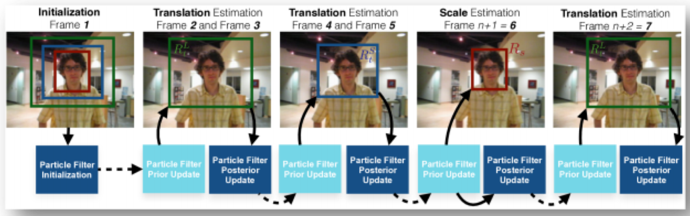
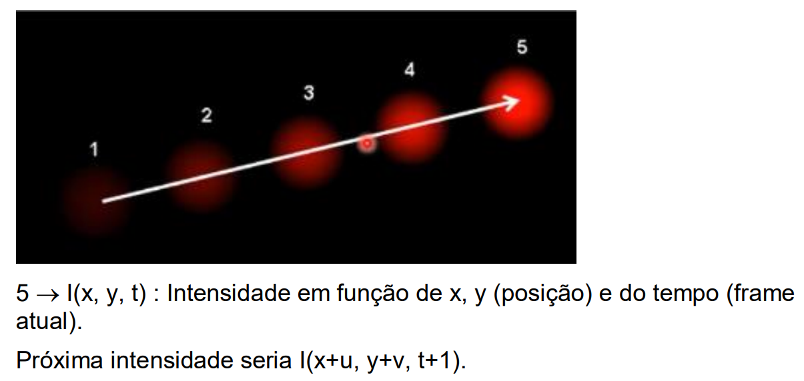

# Courses

## Course **Learning Tracking with OpenCV**

Curso: [Rastreamento de Objetos com Python e OpenCV](https://www.udemy.com/course/rastreamento-objetos-python-opencv/)

- Single Tracking - rastreamento de apenas um objeto
- Multi Tracking - rastreamento de mais de um objeto
- GOTRN Tracking - rastreamento com GOTURN, metodo das redes neurais
- Rastreamento com Detecção - utilza Haarcascade em Imagem
- Rastreamento com Detecção em Video
- Meanshift - install imutils
- CAMShift
- Optical Flow - Sparce
- Optical Flow - Seleção dos objetos
- Optical Flow - Dense

---
### Rastreamento X Detecção

Algoritmo de Rastreamento mais rápidos que de Detecção- as características 
do objeto já foram definidas Na Detecção é necessário extrair as 
características.  
O algoritmo de Detecção é executado a cada frame, enquanto o rastreamento 
roda após o primeiro frame de detecção  
**Problemas:** o objeto pode ser perdido no meio do rastreamento (oclusão - ele 
fica atrás de algo, ou objeto se move muito rápido)  
*Possível usar a Detecção para quando o Rastreamento falhar*  
Quando a Detecção falha pode-se usar o rastreamento (detecção de faces por 
exemplo, quando ocorre oclusão).  
Rastreamento preserva identidade - possível acompanhar o movimento do 
objeto (posições passadas)  

### Algoritmos de Rastreamento

Modelo de Movimento: Prever localização aproximada do objeto no próximo 
quadro (localização + velocidade nos quadros anteriores)
Modelo de Aparência: Pesquisar uma posição próxima para prever a 
localização (aparência do objeto)
Modelo de movimento prevê a localização, de aparência ajusta a estimativa 
(aumenta precisão)
Maioria dos algoritmos já implementa automaticamente!

### Objetivo do Algoritmo

Classificar região retangular como objeto (ou como plano de fundo)
Recebe um patch (recursos/informações detalhadas) da imagem, e retorna 
uma pontuação entre 0 e 1 indicando probabilidade do patch conter o objeto 
(1=é objeto)
Aprendizado de Máquina Online: quando inicia o algoritmo começa a identificar 
o objeto e depois rastrear (treinamento em tempo real de execução)
Aprendizado de Máquina Offline: Treinamento prévio a execução, necessita 
diversas imagens (Redes neurais)

### Tipos de Algoritmos

1. Boosting  
Baseado no Haarcascade – usa o AdaBoost (arquivos haarcascade)  
Um pouco lento (mais antigo) - Aprendizado Online
  - Exemplos positivos = objetos/imagens que quero detectar (1)
  - Exemplos negativos = planos de fundo (0)  
ROI: região de interesse, manualmente selecionada = exemplo positivo  
A cada novo frame o algoritmo classificador é executado nos pixels mais próximos do local anterior do objeto, e a pontuação é registrada (0 ou 1).  
O classificador é atualizado com os dados dos exemplos positivos adicionados 
em cada frame.

2. Multiple Instance Learning (MIL)  
Precisão melhor que o Boosting.  
Define exemplos positivos candidatos (potenciais) aos redores do ROI definido
(bounding boxes). Aumenta as chances de selecionar o objeto corretamente.  
Cria coleção de imagens positivas e negativas (aumenta as chances do objeto 
estar centralizado em uma delas).

3. Kernel Correlation Filters (KCF)  
Mais rápido que MIL e Boosting (propriedades matemáticas tornam rápido e 
preciso).  
Depois de você selecionar o ROI, o algoritimo inicializa o filtro de partículas, e 
gera mais 2 filtros criando 2 novas bounding boxes (externas ao ROI).

Nos frames seguintes atualiza estes filtros, ajustando para contornar melhor o 
objeto, ajustando a mudanças de escala.

4. CSRT  
Discriminative Correlation Filter with Channel and Spatial Reliability  
Cria um mapa de confiabilidade espacial para detectar a região selecionada
(adequado a objetos não retangulares).  
Utiliza padrões de imagens HOGs, baseado em histogramas, e Colornames, 
baseado nas cores do objeto).  
Cria um filtro discriminativo (HOG), extraindo descritores da imagem e indica 
bordas e campos.  
Calcula probabilidade de ser objeto posteriormente (teste aleatório de Markov) 
e faz um patch de treinamento retornando o mapa final de confiabilidade.  
Ref: https://www.arxiv-vanity.com/papers/1611.08461/

5. MedianFlow  
Não adequado a objetos com movimentos rápidos (ou mudem muito a 
aparência).
Rastreia objeto nos frames ao longo do tempo e mede as diferenças da 
trajetória (variações muito grandes dificultam algoritmo).  
Permite detectar falhas de rastreamento e selecionar trajetórias.
Estima o deslocamento usando a mediana X e Y.

6. Tracking Learning Detection (TLD)  
Gera muitos falsos positivos!  
Divide em Rastreamento, Aprendizado e Detecção. O aprendizado estima os 
erros e o detector atualiza o tracking.

7. MOSSE  
Minimum Output Sum of Squared Error.  
Algoritmo mais rápido, mas não tão preciso.  
Correlação adaptativa: produz filtros de correlação estáveis.  
Robusto a variações de iluminação, escala, pose e deformações.  
Detecta oclusões e permite pausar o rastreador e retomar quando objeto 
reaparece.

8. GOTURN  
Generic Object Tracking Using Regression Network  
Implementação baseada no Caffe; Aprendizagem Offline (treinamento com 
milhares de sequencias de vídeos);  
Corta região de interesse no frame, entra na RNA, usa 5 camadas de 
convolução passa para 3 camadas de conexão.  
Retorna o bounding box da localização prevista do objeto.  
Só pode trabalhar com objetos que já foram treinados.

### Comparativos

Algoritmos |  | Comparativos |  |
-----------|---|--------------|---|
CSRT | Maior Precisão | FPS mais Lento | Menor velocidade
KCF | Menor Precisão | FPS mais Rápido | Lida mal com oclusões
MOSSE | Menor Precisão |   | Maior velocidade
Boosting | Menor Precisão |   | Maior velocidade de processamento
MIL | Melhor Precisão |   | Lida mal com oclusões

  
- **Boosting:** Mais rápido, porém perde muito fácil o objeto selecionado
- **CSRT:** Precisão maior, acompanha melhor o objeto – processamento mais 
lento (menor FPS).  
  Quando passa objetos similares tem menos chances de misturar os objetos.
- **KCF:** Menor custo computacional, porém menor precisão (perde menos que o 
boosting, mas ainda tem menos precisão).
- **MOSSE:** Mais rápido dentre eles, mas precisão muito menor (perde fácil o 
objeto).
- **GOTURN:** Precisa dos dados da base caffe e da rede neural na mesma pasta de 
arquivos.  
  Não tem um bom rastreamento para imagens diferentes das do banco de 
dados caffe – por exemplo é capaz de rastrear mãos, mas não dedos

### Algoritmos Shift e Optical Flow

**Algoritmo Meanshift**  

Aproximação dos pixels de acordo com o objeto inicial selecionado, baseado 
em cores.  
Quando a quantidade dos pixels da cor desejada for maior, ajusta o 
rastreamento (máximos de densidade). Feito com média das densidades.  
Probability Density Function: cria um mapa de confiança no frame atual, com 
base nas cores do anterior – usa um histograma para definir a densidade, e o 
deslocamento médio para encontrar o pico de um mapa de confiança próximo.  
Atribui uma probabilidade a cada pixel vizinho da imagem (busca onde há 
maior densidade).  
Utiliza muitos valores padrões da documentação do Opencv.
Parâmetros de parada:

- EPS = quantidade de repetições (maior repetição, maior precisão, menor 
velocidade) para encontrar o ponto com maior densidade
- COUNT = y -mais sensível a mudanças nos pixels (maior sensibilidade, 
maior precisão na detecção, mas não lida bem com variações bruscas)

Cv2. calcBackProject: essa função vai computar a probabilidade de cada 
elemento relacionado com a distribuição de probabilidade.

Janela sempre tem o mesmo tamanho!

**Algoritmo CAMShift**  

Objeto próximo da câmera, ou distante, consegue atualizar o tamanho do 
bounding box (objeto próximo, aumenta bbox).  
Calcula a elipse mais adequada e aplica a mudança de média, para se adaptar 
ao tamanho da janela.  
Menos consistente que o Meanshift por conta da geração das bounding boxes.

**Optical Flow - Sparce**  

Representa a direção e a velocidade de cada pixel (para definir pixel no 
próximo quadro), utilizando HSV.  
Quando objeto está mais próximo da câmera, tem mais pixels para rastrear.  
Quando está mais distante (fica pequeno), tem menos pixels.  
A movimentação então é maior quando está mais próximo.  
H: Matiz, indica direção do movimento do pixel;  
S: Saturação, indica velocidade dos pixels (de um frame a outro);  
V: Intensidade menor quando o deslocamento é menor (menor saturação)  

*Não analisa imagem pixel a pixel.*

Algoritmo:
- Detecta cantos e arestas para definir orientação dos vetores (algoritmo 
de Harris);
  - O algoritmo encontra os valores de deslocamento (u,v) por
determinante;
- De acordo com valor retornado (se R está acima do limite mínimo, é 
considerado canto), cada janela é classificada como plana (plano de 
fundo), aresta ou canto;
- Método KLT, para analisar imagens menores de um mesmo frame
(analise em pirâmide – pega o topo com menos pixels) – para reduzir o 
custo computacional

**Optical Flow – Dense**  

Mais lento que o Sparce, porém mais preciso.  
Além de detectar cantos e bordas, pega a imagem inteira – atualiza tudo a 
cada frame.  
Calcula vetor de fluxo ótico para cada pixel de cada frame (quadro).  
Sparce: fornece os vetores de alguns recursos do quadro (alguns pixels);  
Dense: fornece vetores de fluxo de todo o quadro (todos os pixels);  
Maior movimento, mais intensa a cor (mais próximo);

 

## Course **Python na Prática**

### Comandos no terminal

Pasta atual: pwd (print work directory)  
Listar componentes da pasta: ls  
Mudar o diretório: cd [*novo endereço*]  
Voltar um diretório acima: cd ..  
Tab - permite auto-complete  

### Criando ambiente virtual para Python

1. Estar no diretório onde se quer criar um venv
2. python -m venv "nome-ambienteVirtual"
3. Entrar na pasta Scipts
4. Ativar o venv: activate  (ou, .\activate)
5. Abrir qualquer arquivo: Ir a pasta com o arquivo > code .
6. python arquivo.py #rodar o arquivo desejado
7. Encerrar o ambiente: deactivate
  
**Caminhos e Diretorios**  
from pathlib import Path, PureWindowsPath  
caminho = Path("../pasta/pasta1", "arquivo.extensao")  
arquivo = pd.read_csv(caminho)  
  
**OU** (apenas para windows)  
caminho-arquivo = PureWindowsPath("../pasta/pasta1", "arquivo.extensao")  

### Organizar arquivos em Python

python -m venv "nome-ambienteVirtual"  
(no terminal - powerShell)  
> python  
> import os  
> os.listdir() - diretório atual  
> os.mkdir("pasta") - criar nova pasta  
> os.path.abspath('.') - caminho absoluto do meu diretório atual  
> os.path.abspath('nova') - caminho absoluto da pasta nova  
> os.path.join("nome-pasta","nome-arquivo") - cria um endereço com essa junção, de acordo com o sistema operacional (concatena textos)  
>> os.system('dir') - escrevo o comando normal do terminal  # DIR substitui LS no windows  
  
Saindo do Python - exit()  
> ls  
> zip teste.zip arquivo.txt - zipar um arquivo definido  
> os.system('zip teste.zip arquivo.txt') - dentro do python faço a funçõa do sistema  
  
### ORGANIZANDO EM PASTAS

-> organizar.py  
//TODO

 

## Course **Django**

Comandos inicais/principais  
django-admin startproject [nome-projeto]  
python manage.py startapp [nome-aplicação]  

app - também é um módulo python
- Migartions - descreve banco de dados
- Admin - registrar aplicação

Preciso registrar esse novo app no projeto:  
Projeto > settings.py > INSTALLED_APPS > add nome do app ao final ( 'contas', )

Registrar Banco de dados:  
python manage.py migrate  
Cria banco, e tabelas (permissions, usuarios, secoes)

Rodar projeto: python manage.py runserver  
Criar usuario master: python manage.py createsuperuser (admin, 123456)  
OBS: Django tem app padrão que permite criar ususarios e afins (django.contrib.admin)

**Middleres** do django: fazem validações (settings > MIDDLEWARE)  
Toda view recebe uma request, e retorna uma resposta HTML

Dentro da app crio pasta "Templates" - onde serão puxadas as views  
Dentro de Templates, crio pasta com mesmo nome da app (para garantir que, mesmo se dois apps tenham o mesmo nome, irá chamar o arquivo correto)

**Models**  
Definição do que quero persistir no banco de dados;  
Normalmente cria-se um model para uma tabela;  
Crio uma classe para cada model, e crio os fields da tabela (uma coluna)

Quando herdo de models.Model, ja vem com managers padrão (operações de banco de dados): all (busca todos), filter (parametros para filtrar), last (ultima transação / mais recente), first (primeira transação), etc.

 

## Course **Reconhecimento com OpenCV**

### MODELOS DE DETECÇÃO DE POSICIONAMENTO

Modelos já pré treinados para a detecção dos pontos chave nas pessoas.  
Utilizam redes neurais convolucionais.  
Utilizar algoritimos (treinamentos) já criados  

 **MPII (2014)**

Utilizaram base de dados para treinamento do modelo (human pose dataset - como a base de dados foi cosntruida)  
Possui varias categorias de atividads com inumeras imagens, e avaliação e resultados dos modelos - para cada um dos pontos (cabeça, ombro...)  
Produz 15 pontos chave no corpo.

**CAFFE (2016 - COCO - Comum Objects in Context)**

Produz 18 pontos chave

**REDES NEURAIS CONVOLUCIONAIS (RNC)**  
Etapa 1: Operador de Convolução  
- Aplico um filtro detector de características (feature detector) a imagem (imagem é reduzida).  
- Aplicação da função de ativação (Relu): onde tiver valor menor que 0, aplico 0 (não há números negativos)  
- Essa função d eativação em redes neurais de convolução para imagem, feita para extrair as caracteristicas principais da imagem.  
- Gero um mapa de características  

Etapa 2: Pooling
- Aplica fórmula de Max Pooling ao mapa de características, reduzindo ainda mais as dimensões da imagem (focando em características principais).
- A imagem original gera varios mapas de caracteristicas (define-se previamente quantos mapas serão gerados na função Relu).
Aplica-se então o Max Pooling para cada um dos mapas.
- TerceAcabo reduzindo a imagem, e a RN foca apenas na parte principal da imagem.

Etapa 3: Flattening
- Transformar a matriz do max pooling em um vetor para a etapa 4

Etapa 4: Rede Neural tradicional
- O vetor é submetido a uma rede neural densa tradicional, com camada de saída Sigmoid (significa que trabalhamos com 2 classes - por exemplo rede neural para id gatos e cachorros).

**ARQUITETURA VGGNET**  
Rede neural convolucional, utilizada como base para os modelos MPII e CAFFE.  
Os modelos precisam de umagem na entrada com 2 dimensões (alturaxlargura) - irá sair com a marcação 2D dos pontos chave de cada pesssoa na imagem.

1. Entro com imagem na RNC  
2. Faz previsão de mapas de confiança  
  Ex: se quero fazer a detecção da cabeça da pessoa - para esse ponto da cabeça vão existir vários pontos candidatos, porém somente um deses pontos vai ser usado para a imagem final.  
3. Mapa de confiança: prevê se pontos estão nas posições corretas  
4. O modelo entra com vários pontos candidatos, cada ponto terá um nível de confiança e seleciona-se o de maior confiança

(mapas) Campos de afinidade para associação entre as partes:  
Indicam se um ponto pode ser associado a outro (ex: joelho e pé estão associados - próximos um do outro)

Análise e Previsão:  
1. encontra partes do corpo (pescoço, braço, pé)
2. contruir pose do corpo todo (definir ligaççao entre os pontos - pé + perna)

OBS: Soft Max - função de ativação usada em redes neurais quando se tem problemas de classificação com mais de duas classes (adicionada ao final do processo)
Modelo MPII - retorna 15 pontos
Modelo CAFFE - retorna 18 pontos

### MULTIPLOS ESTÁGIOS DE DUAS RAMIFICAÇÕES

Ao entrar com a imagem são aplicadas várias camadas de convolução e de pooling.  
Em seguida, em um primeiro estágio, saem as ramificações, uma para prever mapas de confiança (indicar confiabilidade de cada um dos pontos - cabeça, braço, perna...) e outra para prever mapas de afinidade (associação entre as partes).  
Dentro de cada ramo são de novo passadas algumas convoluções.  
Por fim, esses mapas são concatenados, e define-se uma saída que é passada para o próximo estágio.  
Os estágios seguintes utilizam o mesmo processo.

Ao fim de todos os estágios a saída é a construção da pessoa a partir dos pontos (bonequinho palito).  
Na saída dos modelos, cada ponto refere-se a uma parte do corpo.  
Pode se usar os pontos para análise de uma parte única do corpo.

### DETECÇÃO (do corpo ou parte)

Etapa 0: As 10 primeiras camas do VGGnet detectam todos os pontos do modelo (mapa de calor ajuda a definir onde estão as detecções)  
--detecta todos os pontos  
Etapa 1: RNC de multiplos estágios de 2 ramos prevê um conjunto de mapas de confinaçã 2D de localizações de pontos específicos  
--gera mapas de confiança e afinidade  
Etapa 2: Mapas de confinaça e afinidade são analisados por inferência gananciosa para produzir os pontos chave 2D (finais)  
--define os pontos finais

### MAPAS DE CONFIANÇA E AFINIDADE

Método forward: previsão par classe DNN do opencv - retorna matriz 4x4
- Dimensão 1: ID da imagem (caso mais de uma img)
- Dimensão 2: indice de um ponto chave
  (modelo produz mapa de confinaça e afinidade concatenados)

CAFFE consiste em 57 partes = 18 pontos chaves + 19 plano de fundo, e é multiplicado por 2 mapas de afinidade (ex: pescoço conta também com ombro direito e esquerdo)  
- Dimensão 3: Altura do mapa de saída (posição de cada ponto na vertical - y)
- Dimensão 4: Largura do mapa de saída (posição de cada ponto na horizontal - x)

Um mapa de confiança: imagem em escala de cinza que tem um valor alto em locais onde a probabilidade de uma determinada parte do corpo é alta.

Modelo CAFFE prevê conjunto de campos vetoriais 2D de afinidades (PAF) que codificam o grau de associação.

 

## Course **Processamento de Imagens**

Usando biblioteca Pillow

(0,0) = canto superior esquerdo (primeiro pixel)  

- Image.getpixel((x,y)) : Retorna valor (RGB) do pixel em uma posição (input eh uma tuple)
- Image.putpixel((x,x),(r,g,b)) : substituir o valor de cor que está no pixel
Imagens em PNG resultam em 4 digitos de tupla (R,G,B,opacidade)

### Criando nova imagem do zero

Pillow docs -> Image -> New Image  
Image.new(mode = tipo de sistema de cor (RGB),  
            size = (Pixels Largura, Pixels Altura),  
            color = (default = 0 // tupla (R,G,B)))  

**Bandeira do Brasil:**  
largura = 20cm  
altura = 14cm  
raio = 3,5cm  
distancia losango as bordas = 1,7cm  

abertura.py

### Cores

Preto e branco ficam com exatamente mesmos valores para RGB  

- Brilho máximo = Branco
- Brilho mínimo = Preto
No preto e branco a informação dada é o brilho - intensidade.  
- Luminancia = quantidade para descrever um pixel na escala de cinza

Os pesos para considerar no RGB são padrão (30% Red, 59% Green, 11% Blue)  
Feito média ponderada para ter a Luminancia  

**Luz Visível**  
Toda cor enxergavel a olho humano está numa faixa específica de freqência  
Quando ela tem uma única frequência (não é mistura ou combinação de freqência) é cor MONOCROMATICA (ou Espectral Pura)  
Branco -> mistura de varias cores espectrais puras (com a mesma intensidade)  

Os 3 tipos de cones dos olhos:  

1. Faz amostragem em baixa frequência (verde)
2. Faz amostragem em alta frequência (azul)
3. Faz amostragem na zona intermediária (vermelho)
  
**Metamerismo:** quando duas cores tem frequências diferentes mas são percebidas como iguais (visão humana)  
Comprimeintos de onda: RED 700nm, GREEN 546nm, BLUE 435,8nm  

OUTRA CLASSE DE SISTEMA DE CORES  
Crominância e Luminancia: Separam iluminação do núcleo da cor (crominância)  
Para clarear ou escurecer no RGB, é necessário mexer em todas as cores.  
  
escala_cinza.py  
utils.py  
sinteticas.py  

### Filtros de Imagens

- Filtro: transformação UNÁRIA - não pode usar um elemento externo pra fazer modificações (utilza apenas valores que já estão presentes)
- Filtros convolucionais: Filtros lineares espacialmente invariante (mesmo comportamento em qualquer parte da imagem)

Regiões mais lisas são de baixa frequência.  
Filtro de borramento é de PASSA-BAIXA (filtra as frequencias altas / detalhes e contornos)  
Filtro de realce das bordas é de PASSA-ALTA (filtra as regiões homogenias/frequencias baixas)  

#### Filtros Convolucionais

- Linear: Causa modificação em imagem, que podemos calcular a partir de valores de pixel na região da imagem
Novo valor do pixel é média ponderada dos pixels no entorno.
- Espacialmente invariante: Se comporta da mesma maneira em todas as regiões da imagem
Combinação linear!  
- Filtro BOX: Todos os pesos da média ponderada são iguais - causa borramento
  
Borramento =~= espalhamento da quantiade de luz chegando na camera (aumenta regiões mais lisas)  
Matriz do filtro passa em cima da matriz da imagem (Padding: definir como zeros os valores da matriz nas extremidades)  

ImageFilter.BoxBlur(tamanho da matriz - numero de pixels para o lado)  
  
Aresta: regiões onde tem variação nos tons, fronteira entre objetos ou variação de textura.  

filtros.py //FIXME

**Máscara Binária**: Criar outra imagem constituida de 0 e 1, que vai indicar onde deve fazer a substituição (CHROMA KEY)  

Sistema de Cor: HSV (Sistema circular, em graus e porcentagem) - color picker  
Hue: Cor (matiz - graus)  
Saturation  
Value  

 

## Livro **Introdução a Visão Computacional com Python e OpenCV**

[**Introdução a Visão Computacional com Python e OpenCV** - *Ricardo Antonello*](https://cv.antonello.com.br/wp-content/uploads/2017/02/Livro-Introdu%C3%A7%C3%A3o-a-Vis%C3%A3o-Computacional-com-Python-e-OpenCV-3.pdf)

### main01

- Capitulo 01: Introdução  
imagem.shape = altura, largura, quantidade de canais de cores
- Capitulo 02: Sistema de Coordenadas e Manipulação de Pixels  
imagem[altura, largura] = (blue, red, green)
- Capitulo 03: Fatiamento e desenho sobre a imagem  
Slicing: pegar parte da imagem para modificar  
imagem[150:300, 250:350] = (0, 255, 0)  --> Cria um retangulo verde da linha 150 a 300 nas colunas 250 a 350

### main02

- Capitulo 04: Transformações e máscaras  
Recortar, Redimensionar, Rotacionar  
**Transformação *affine*:** função que preserva pontos, grossura de linhas e planos, e a proporção das distâncias entre os pontos de uma reta. (rotação é um tipo de transformação *affine*)  
**Máscaras:** imagem com pixels pretos ou brancos.
- Capitulo 05: Sistema de Cores  
Preto e branco, Tons de cinza, Lab, HSV  
É possível separar canais de uma imagem -> cv2.split(imagem)

### main03

- Capitulo 06: Histogramas e equalização de imagem  
**Histograma:** gráfico de colunas ou de linhas que representa a distribuição dos valores dos pixels de uma imagem - a quantidade de pixeis mais claros (próximos de 255) e a quantidade de pixels mais escuros (próximos de 0).  
**Equalização do histograma:** distribuir de maneira mais uniforme a intensidade dos pixels na imagem.

