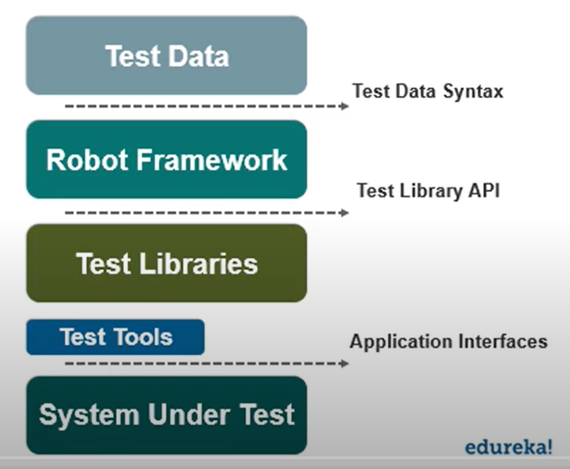
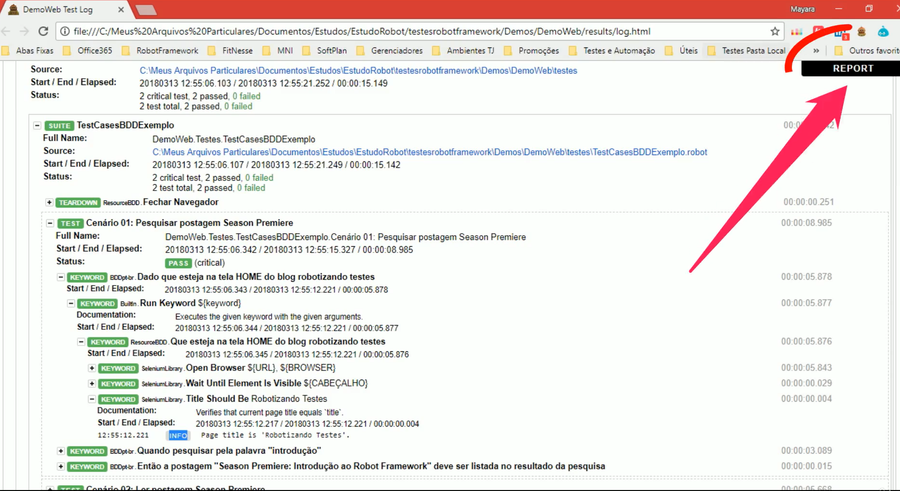
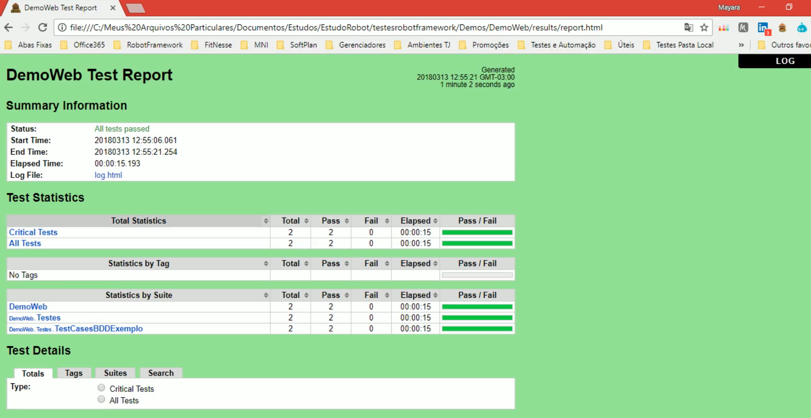

# Robot Framework in Python

## General Notes
Generic open source automation framework. It can be used for test automation and robotic process automation (RPA).  
Robot Framework is open and extensible, can be integrated with virtually any other tool to create powerful and flexible automation solutions and is free to use without licensing costs.

  
[More Info](https://youtu.be/d-KWz7euLlc)

- **Libraries**

  - **Builtin**: basic commands. Is imported automatically.  
    Assertions; Convert or Set variables; Logs; 
  - **Collections**: List or Dictionaries assertions
  - **DateTime**  
    Allows for simple calculations, like subtract time from date, and add time from time;
  - **Dialogs**: provides means for pausing test execution
  - **OperatingSystem**
  - **Process**: Running process in a system, starting processs, waiting for process
  - **Screenshot** (requires virtual or physical display for test)
  - **String** (manipulation and verification)
  - **Telnet**: connect telnet servers and execute commands
  - **XML**: verify and modify XML documents

- **Build-In Tools**

  1. Testdoc
  2. Rebot
  3. Libdoc
  4. Tidy

- **Test Cases**

  Robot framework test data defined in different sections.

    1ª. Settings
        Importing resource file librarires, variable files and defining mtadata for test cases and test suits;  
    2ª. Variables
    3ª. Test Cases
    4ª. Pass
    5ª. Keywords
    6ª. Comments

  Can follow Workflow Tests, Data-Driven tests and High Level tests.

- **Keywords**

  Library keywords: Lowest level keywords, from the language used;  
  User keywords: One of the featuresof robot framework - making custom, high level keywords;

- **Variables**

  Defining and Using

- **Organizing Test Cases**

  - *Setups and Teardowns*

    Specif keyword to be executed before or after a test - use "*Test Setup*" and "*Test Teardown*".  
    To eecute before or after a test suit use "*Suit Setup*" and "*Suit Teardown*"

  - *Tags*

    Force tags and Default tags.  
    After execution the report will have tags with the test cases associated with them, and statistics based on the tags.

- **Selenium Library**

  Install *selenium library* and *browser drivers*

# [Automação de Testes com Robot Framework - Básico](https://www.udemy.com/course/automacao-de-testes-com-robot-framework-basico/)

Estruturado em Desenvolvimento Dirigido a Testes de Aceitação (ATDD);  
Baseado em *keyword driven* (escrita de testes alto nível);  
- Librarires: Selenium, Request (API), etc;
É possível desenvolver ou customizar libraries;

Camada "Test data" - onde entram as keywords (dados, ações) para desenvolver os testes;  
Robot busca as Librarires para interpretar os testes;

Executar *robot* e salvar resultados em uma pasta específica (cmd):

    robot -d pastaDosResults pastaComArquivosDeTestesParaExecutar

OU

    robot -d pastaResults pasta/arquivoEspecifico.robot

Exemplo de Log:  
  
Exemplo de Report:  

> robot -d resultsAPI .

As Keywordssão abstrações de suas implementações:

    Open Browser https://www.site.com chrome
Abstração de um script em Python (com Selenium WebDriver): 

    def open_browser(self): 
        self.driver = webdriver.Chrome()
        self.driver.implicity_wait(20)
        self.base_url = "https://www.site.com"
        self.verificationErrors = []
        self.accept_next_alert = True

- Fácil leitura, entendimento e **manutenção**;
- Sequencia de *keywords* pode se tornar a documentação;
- Bom para testadores não técnicos;

Libraries usadas:  
Acessar em [RobotFramework](https://robotframework.org/#libraries)  

Instalar - [Selenium Library](https://github.com/robotframework/SeleniumLibrary/#installation)  
[SeleniumLibrary Keywords](https://robotframework.org/SeleniumLibrary/SeleniumLibrary.html)

Instalar - [API Library - *Requests*](https://github.com/MarketSquare/robotframework-requests#install-stable-version)

**Suite de Testes**: Todo o arquivo com todos os Test Cases.

**Setttings**: Configuração da Suite

- Documentation (keyword)
- Test Setup (keyword) *antes de cada teste*
- Test Teardown (keyword) *após cada teste*

> taskkill /im chromedriver.exe /f  

Extensão do Chrome: [TruePath](https://qaworld.ga/truepath/)

Executar apenas um teste (um caso de teste):  
> robot -t "Titulo do caso de teste" nomeDoArquivo.robot

Ajuda do Robot:  
> robot --help

Executando com base em Tags

Executa apenas testes com a tag:  
> robot -i nomeTag nomedoArquivo.robot

Executa todos os testes exceto com a tag:
> robot -e nomeTag nomedoArquivo.robot

Substituir valor de uma variavel global:  
> robot -v VARIAVEL:valor nomedoArquivo.robot